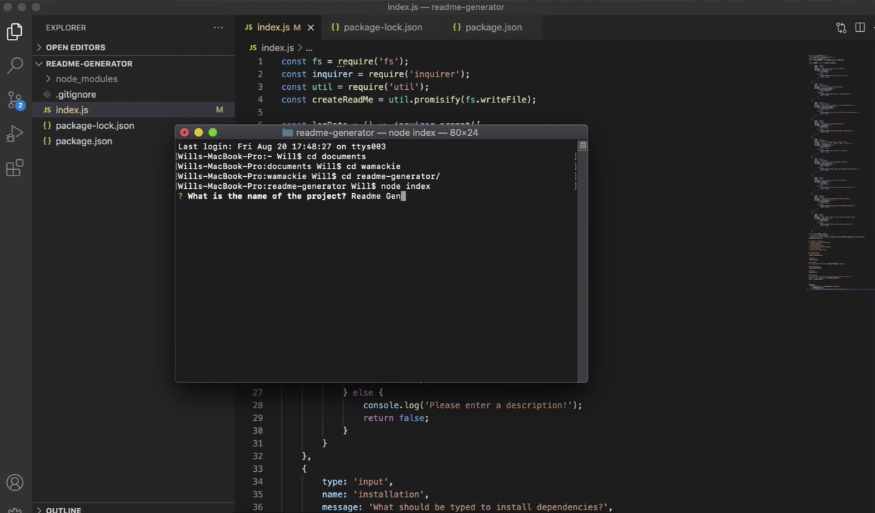

# Readme Generator
 
Creates a professional readme using node

## Walkthrough Video

    
## Table of Contents
* [Installation](#installation)
* [Usage](#usage)
* [License](#license)
* [Contributing](#contributing)
* [Tests](#tests)
* [Questions](#questions)
    
## Installation
To install: 
npm install
    
## Usage:
Install dependencies before use. Use the console to "run index" in the root folder.
    
## License:
This application uses the MIT license.
    
## Contributing:
When contributing to this repository, please first discuss the change you wish to make via email.
    
## Tests:
None
    
## Questions:
Feel free to contact regarding any questions you may have. 
Github: https://github.com/wamackie 
Email: wamackie8456@gmail.com
